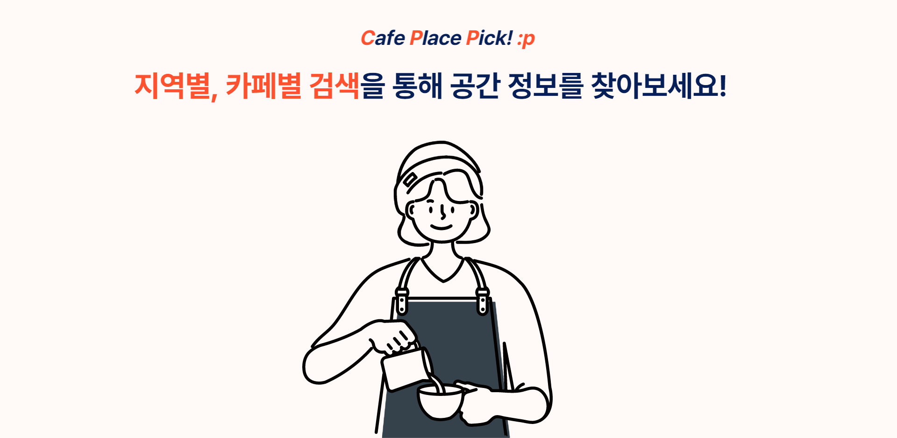

# c:p:p

감각적인 카페를 찾고 계신가요? :~~p~~

검색했더니 다른 카페가 소개된다구요? 광고라구요? :(

현재 내 위치 기준 거리별, 지역별, 카페별 검색을 통해 정확한 후기를 찾아보세요! :D

✅  C:P:P는 트렌디 하고 좋은 카페를 소개하는 서비스로, 내 주변의 좋은 공간을 쉽게 찾을 수 있습니다.

✅  C:P:P는 사진과 글 형태로 공간이 소개되며, 별점으로 공간을 평가 할 수 있습니다.

✅  `#내돈내산` 영수증 인증으로 불필요한 광고를 차단 할 수 있고, 사용자들의 인증 문화를 장려합니다.

✅  잘못된 정보를 차단함으로써 정확한 정보를 얻을 수 있습니다.

✅  C:P:P는 실제 사용한 사용자들의 솔직한 평가를 기반으로 하여 다른 사용자들에게 정보를 공유할 수 있습니다.

 

---

 

### [프로젝트 노션](https://shard-riverbed-e01.notion.site/C-P-P-cca45e2972f545c1b847190b35b260cd)

### [API 문서](https://shard-riverbed-e01.notion.site/71cd35915d5744ef9f37205e118f1ea2?v=fbcd74b5ddea42b5878580cdd2d1e992)

 

---

 

## 멤버

### 구현준

-   Role : Team Crew
-   Position : Full Stack
-   Github : 🔗[anonymous777777777](https://github.com/anonymous777777777)
-   Email : ✉️ hyunjoon69916991@gmail.com

### 김소연 (PM)

-   Role : Team Leader
-   Position : Front-end
-   Github : 🔗 [soyeon112](https://github.com/soyeon112)
-   Email : ✉️ kimsoyeon1112@gmail.com

### 김익수

-   Role : Team Crew
-   Position : Back-end
-   Github : 🔗 [gimmicks-u](https://github.com/gimmicks-u)
-   Email : ✉️ iksukis8604@gmail.com
-   Works

### 류승연

-   Role : Team Crew
-   Position : Front-end
-   Github : 🔗 [ryuttung](https://github.com/ryuttung)
-   Email : ✉️ seung43422@gmail.com
